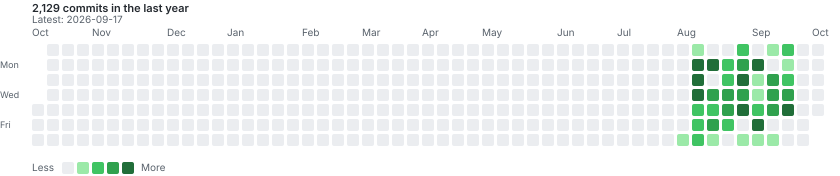

# speed

https://github.com/user-attachments/assets/b0e4f28d-5af5-4dd3-964b-cc9ec8e97234

## Commit activity

Activity from the private repository, shown for the trailing year.

Maintainer setup

Add an Actions secret with read-only Contents access to
the private repository, then run **Update private commit calendar**
once. Add token to private with Contents write access to
`speed-web` for immediate refreshes after each push.

